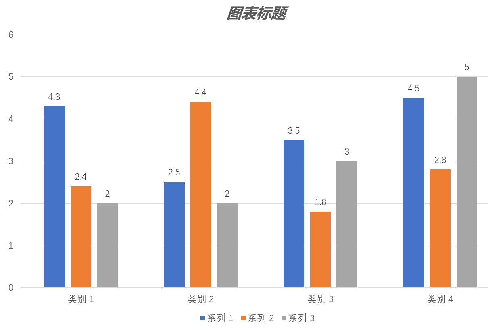
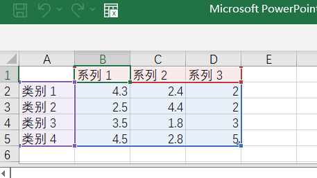
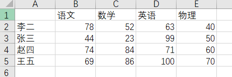
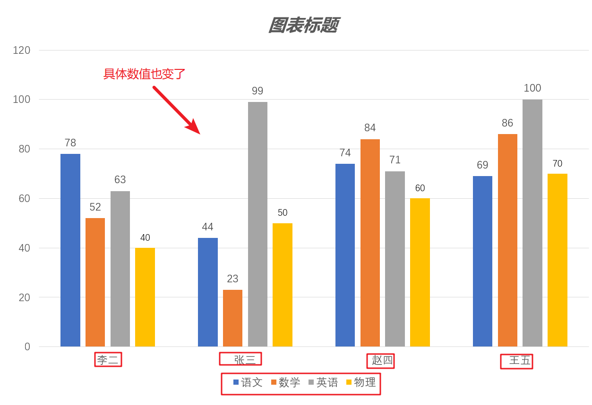
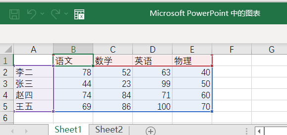

## 项目来源
该项目源自于公司人力资源部门的需求，公司每年需要对各个领导层发送一个XX信息的 PPT，且不同层级、不同分公司、不同部分可以看到的数据有限制，PPT模板也比不尽相同。
目前公司每两年更新一次 PPT 模板，每次更新需要花费三个月的时间人工修改，代价太大，因此希望实现自动化的修改操作。
> 讲道理，两年变一次模板等于差不多重新开发了，有毒。

本项目就是借此机会，希望基于 Apache POI 封装一个操作 Office 文件的工具类，供大家参考。
## 关键难点
- 图表的定位
- 嵌入的 Excel 文件的修改
- 图表中的数据修改
- 增删类别和种类时，图表的自动修改


目前主要的操作 Office 文件的工具只有 Java 的 Apache POI 和 Python 的 PPTX。其中，PPTX 库只支持 6 种图表，
故只能选择 Java POI。但是 POI 关于 PPT 文件的操作没有技术文档，源码里也没有有效注释，所以需要自己结合 PPTX 
文档的结构和代码研究摸索。

## 演示案例
### 基于 Excel表格数据修改PPT文件中的图表
原始 PPT 图表样式如下：



其嵌入的 Excel 表格如下：



下面我们在将该 PPT 图表根据 test.xlsx 文件中的数据修改：



```java
import com.ice.office.domain.pptx.Presentation;
import com.ice.office.domain.pptx.chart.Chart;
import com.ice.office.domain.xlsx.Workbook;

public class Demo01 {
    public static void main(String[] args) {
        Presentation presentation = new Presentation("test.pptx"); // 打开模板PPT
        Chart chart = presentation.getCharts().get(0); // 获取幻灯片第一个图表
        chart.updateBarChart(new Workbook("test.xlsx"), 0); // 更新该树状图（是哪种类型图表需要提前知道的）
        presentation.writeTo("output.pptx"); // 输出修改结果
    }
}
```
此时我们看看输出结果 output.pptx：
其图表已经变为：



嵌入的 Excel 数据也一起变了：

